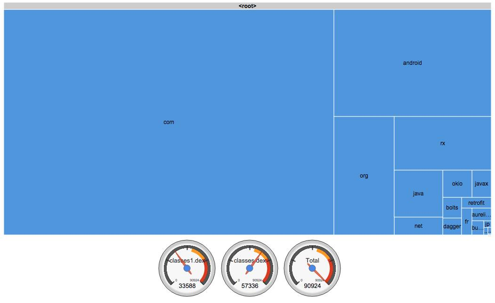

# Usage

## Configure Plugin
Configure plugin in `build.gradle`
```groovy
buildscript {
  repositories {
    maven {
      url "https://plugins.gradle.org/m2/"
    }
  }
  dependencies {
    classpath "gradle.plugin.net.siggijons.dex:dex-methods:0.3.1"
  }
}

apply plugin: "net.siggijons.dexmethodcount"
```

## Generate report
```
./gradlew :app:countDebugDexMethods
open quizup/build/reports/dex-count
```

## Dig into method count

